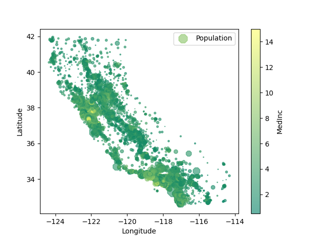

### The Housing Dataset Recommendation System

#### TOC

1. [About the Project]()
2. The Recommendation System
3. Conclusions

***

#### 1. About the Project

This project provides a hands-on experience to work with selected sorting and searching algorithm on a large dataset. I have selected the quick sort and binary search algorithms due to their popularity and reasonable time complexities (i.e., O(n*log(n)) and O(log(n)), respectively).

This project consists of the following files:

- script.py: contains the main script and can be executed with the command python script.py.
- utils.py: contains the helper functions.
- plot_housing_dataset.png: the image showing the plot of the california housing dataset.
- Readme.md: the current file that describes the project.
- requirements.txt: contains the list of installed python packages.

This project has been tested on an anaconda environment with python version 3.9. A minimal anaconda environment was build using the command: conda create --name minimal_py39 --no-default-packages python=3.9. The needed packages are then installed using the conda install commands. The list of installed packages have been exported to a requirements.txt file using the command pip freeze > requirements.txt.

This project uses the open-source housing dataset that can be loaded from the scikitlearn python library as follows:

```
from sklearn.datasets import fetch_california_housing
import pandas as pd

housing = fetch_california_housing()
```

To view the description of the dataset, type:

```
print(housing.DESCR)
```

The output is as follows:

.. _california_housing_dataset:

California Housing dataset
--------------------------

**Data Set Characteristics:**

    :Number of Instances: 20640
    
    :Number of Attributes: 8 numeric, predictive attributes and the target
    
    :Attribute Information:
        - MedInc        median income in block group
        - HouseAge      median house age in block group
        - AveRooms      average number of rooms per household
        - AveBedrms     average number of bedrooms per household
        - Population    block group population
        - AveOccup      average number of household members
        - Latitude      block group latitude
        - Longitude     block group longitude
    
    :Missing Attribute Values: None

This dataset was obtained from the StatLib repository.
https://www.dcc.fc.up.pt/~ltorgo/Regression/cal_housing.html

The target variable is the median house value for California districts,
expressed in hundreds of thousands of dollars ($100,000).

This dataset was derived from the 1990 U.S. census, using one row per census
block group. A block group is the smallest geographical unit for which the U.S.
Census Bureau publishes sample data (a block group typically has a population
of 600 to 3,000 people).

An household is a group of people residing within a home. Since the average
number of rooms and bedrooms in this dataset are provided per household, these
columns may take surpinsingly large values for block groups with few households
and many empty houses, such as vacation resorts.

It can be downloaded/loaded using the
:func:`sklearn.datasets.fetch_california_housing` function.

.. topic:: References

    - Pace, R. Kelley and Ronald Barry, Sparse Spatial Autoregressions,
      Statistics and Probability Letters, 33 (1997) 291-297 

#### 2. The Recommendation System

Below shows the first 10 rows of the housing dataset (Table 1), along with the plot showing the location, population, and median income (Figure 1). 

**Table 1. The first 10 rows of the housing dataset.**

```
   MedInc  HouseAge  AveRooms  AveBedrms  Population  AveOccup  Latitude  Longitude  rel_distance
0  8.3252      41.0  6.984127   1.023810       322.0  2.555556     37.88    -122.23    214.024301
1  8.3014      21.0  6.238137   0.971880      2401.0  2.109842     37.86    -122.22    212.654880
2  7.2574      52.0  8.288136   1.073446       496.0  2.802260     37.85    -122.24    212.929036
3  5.6431      52.0  5.817352   1.073059       558.0  2.547945     37.85    -122.25    213.313681
4  3.8462      52.0  6.281853   1.081081       565.0  2.181467     37.85    -122.25    213.313681
5  4.0368      52.0  4.761658   1.103627       413.0  2.139896     37.85    -122.25    213.313681
6  3.6591      52.0  4.931907   0.951362      1094.0  2.128405     37.84    -122.25    212.824709
7  3.1200      52.0  4.797527   1.061824      1157.0  1.788253     37.84    -122.25    212.824709
8  2.0804      42.0  4.294118   1.117647      1206.0  2.026891     37.84    -122.26    213.211030
9  3.6912      52.0  4.970588   0.990196      1551.0  2.172269     37.84    -122.25    212.824709
```


**Figure 1. A plot of the housing dataset.**

Running the script.py program will load the california housing dataset and display the above plot. To proceed, the user should close the map and decide whether to view the available list of housing criteria (y/n). After that, the user can select from the following three options:

 (1) View the top or bottom 20 sorted list.
 (2) Filter housing data.
 (3) View all data.

#### 3. Conclusions

From this project, I learned to implement the quick sort and binary search algorithms and realize the challenges with implementing such algorithms from scratch, as follows: 

- The efficiency of the sorting and searching algorithms depend on the choice of algorithms. 
- The binary search algorithm searches for a specific value in a list. I had to, therefore, add a linear search algorithm to extract the rest of the duplicated elements in the list. Moreover, the binary search algorithm will not yield any values if the search criteria does not coincide with any of the values in the list. 

The search, sort, and filter functions that are put together in this project can be easily and more efficiently implemented using python built-in modules or python libraries (e.g., pandas). For instance, filtering and sorting can be done on pandas dataframe using the logical operators and the sort_values() method, respectively. 

***
